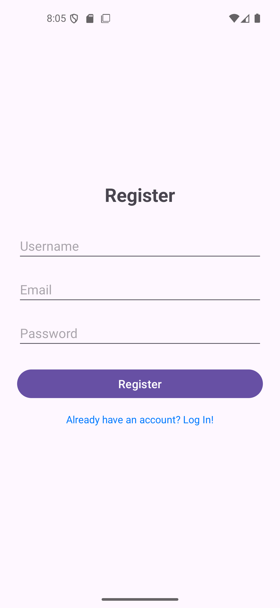
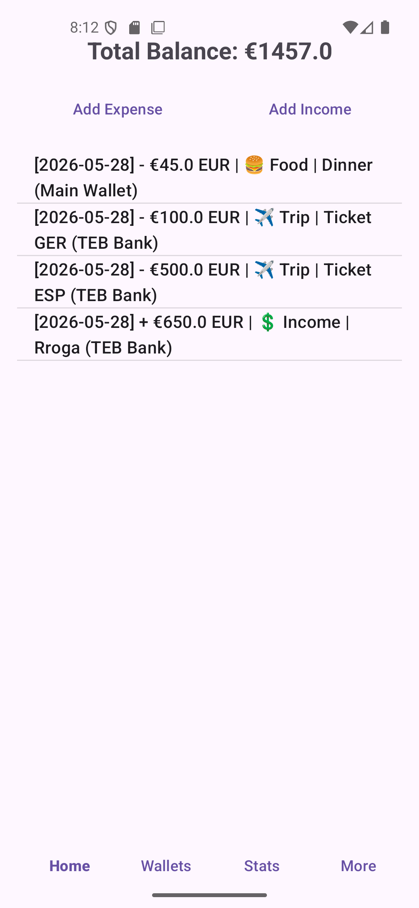
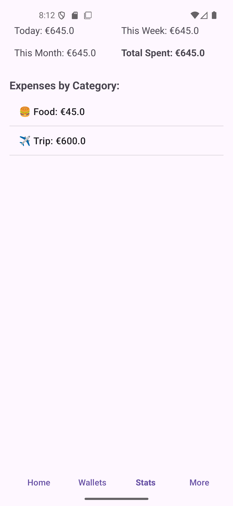

# ExpenseTracker

A simple expense tracking Android app built with Java and SQLite.

## Features

- User registration and login
- Create and manage multiple wallets
- Add, edit, and delete expenses
- Add, edit, and delete income transactions
- Track total balance across all wallets
- View spending statistics (daily, weekly, monthly, total)
- Spending breakdown by category
- Custom categories with emoji icons

## Tech Stack

- Java
- SQLite (local database)
- Android SDK

## Database Schema

- **users** - user authentication
- **wallets** - wallet management with balance tracking
- **categories** - expense categories (default + custom)
- **expenses** - expense transactions
- **income** - income transactions

## Screenshots

| Logo | Login | Register |
|------|-------|----------|
|  |  |  |

| Home | Statistics                                  | Wallets                                 |
|------|---------------------------------------------|-----------------------------------------|
|  |  |  |

## Setup

1. Clone the repository
2. Open in Android Studio
3. Build and run on emulator or physical device

## Usage

1. Register a new account
2. Login with your credentials
3. Create wallets to organize your money
4. Add expenses and income transactions
5. View statistics to track your spending

## Author

Elona Heta